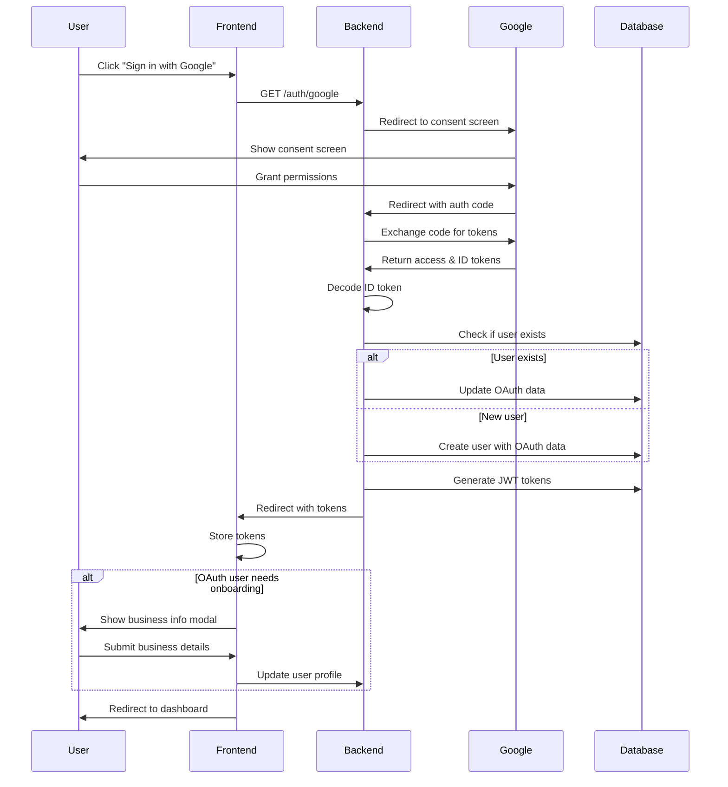

# Google OAuth Integration Plan

## Overview

We'll implement Google OAuth 2.0 using the **Authorization Code Flow** (recommended for security). The flow will:

1. Frontend redirects user to backend OAuth endpoint
2. Backend redirects to Google's consent screen
3. Google redirects back with authorization code
4. Backend exchanges code for tokens and creates/links user account
5. OAuth users are redirected to dashboard with a modal to collect business info

## Architecture

### Flow Diagram




## Database Changes

### 1. Update User Entity

**File:** `[api/src/users/entities/user.entity.ts](api/src/users/entities/user.entity.ts)`

Add new columns:

- `googleId` (nullable string) - Store Google's unique user ID
- `oauthProvider` (enum: 'local' | 'google') - Track how user signed up
- `profilePictureUrl` (nullable string) - Already exists as `avatarUrl`
- `onboardingCompleted` (boolean, default: false) - Track if OAuth users completed business info collection

### 2. Create Migration

Generate TypeORM migration to add OAuth-related columns safely without breaking existing data.

## Backend Implementation

### 1. Install Dependencies

```bash
npm install passport-google-oauth20 @types/passport-google-oauth20
```

### 2. Environment Variables

**File:** `[api/.env](api/.env)`

Add:

```
GOOGLE_CLIENT_ID=16734530854-d5p6ep0iclh3itbfgplhgjdt7epdhkvl.apps.googleusercontent.com
GOOGLE_CLIENT_SECRET=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
GOOGLE_CALLBACK_URL=http://localhost:8000/api/v1/auth/google/callback
```

### 3. Create Google OAuth Strategy

**New file:** `api/src/auth/strategies/google.strategy.ts`

Implement PassportStrategy for Google OAuth:

- Validate ID token from Google
- Extract user profile (email, name, picture, Google ID)
- Return user data for processing

### 4. Update Auth Service

**File:** `[api/src/auth/auth.service.ts](api/src/auth/auth.service.ts)`

Add methods:

- `validateOAuthUser(email, googleId, name, picture)`: Check if user exists
  - If email exists but no `googleId`: **Auto-link** account (add `googleId` to existing user)
  - If user doesn't exist: Create new user with `onboardingCompleted: false`
  - Return user object
- `googleLogin(user)`: Generate JWT tokens and return response

### 5. Update Auth Controller

**File:** `[api/src/auth/auth.controller.ts](api/src/auth/auth.controller.ts)`

Add endpoints:

- `GET /auth/google` - Initiates OAuth flow (redirects to Google)
- `GET /auth/google/callback` - Handles callback from Google
  - Exchanges auth code for tokens
  - Creates/links user account
  - Redirects to frontend with JWT tokens as query params

### 6. Update Auth Module

**File:** `[api/src/auth/auth.module.ts](api/src/auth/auth.module.ts)`

Register GoogleStrategy in providers array.

### 7. Update Users Service

**File:** `api/src/users/users.service.ts`

Add methods:

- `findByGoogleId(googleId)`: Find user by Google ID
- `createOAuthUser(email, name, googleId, picture)`: Create OAuth user
- `linkGoogleAccount(userId, googleId, picture)`: Link Google to existing account
- `updateOnboardingStatus(userId, completed)`: Update onboarding flag

### 8. Create DTOs

**New files:**

- `api/src/auth/dto/google-auth.dto.ts`: Response DTO for OAuth success
- `api/src/users/dto/complete-onboarding.dto.ts`: DTO for business info submission

## Frontend Implementation

### 1. Update Login/Signup Pages

**Files:** 

- `[our-app/app/(auth)/login/page.tsx](our-app/app/(auth)`/login/page.tsx)
- `[our-app/app/(auth)/signup/page.tsx](our-app/app/(auth)`/signup/page.tsx)

Replace dummy `handleSocialLogin` with:

```typescript
const handleSocialLogin = (provider: 'google' | 'facebook') => {
  if (provider === 'google') {
    window.location.href = `${API_BASE_URL}/auth/google`;
  }
};
```

### 2. Create OAuth Callback Handler

**New file:** `our-app/app/(auth)/oauth/callback/page.tsx`

This page handles the redirect from backend:

- Extract JWT tokens from URL query params
- Store tokens using `setAuthTokens()`
- Check if `onboardingCompleted=false` in user profile
- Redirect to dashboard (onboarding modal will show if needed)

### 3. Create Onboarding Modal Component

**New file:** `our-app/components/dashboard/onboarding-modal.tsx`

Beautiful modal using Mantine with steps:

1. **Business Name** - Text input
2. **Business Type** - Select dropdown (same options as signup)
3. **Goals** - Multi-select checkboxes (same as signup step 3)

Features:

- Cannot be dismissed (required for OAuth users)
- Smooth animations
- Shows progress indicator
- Calls API to update user profile on submit

### 4. Update Dashboard Page

**File:** `[our-app/app/(dashboard)/dashboard/page.tsx](our-app/app/(dashboard)`/dashboard/page.tsx)

Add logic:

- Fetch current user profile on mount
- Check `onboardingCompleted` flag
- Show onboarding modal if `false`

### 5. Update API Client

**File:** `packages/api-client/ui-clients/authentication/authentication.ts`

Add generated endpoints (or manually add):

- `useAuthControllerGoogleLogin()` hook
- `useUsersControllerCompleteOnboarding()` hook

## Security Considerations

1. **Token Storage**: Store Google's ID token securely (not needed client-side)
2. **CSRF Protection**: Use `state` parameter in OAuth flow
3. **Secure Secrets**: Never expose `GOOGLE_CLIENT_SECRET` to frontend
4. **HTTPS Only**: In production, use HTTPS for all OAuth redirects
5. **Token Validation**: Backend must verify Google's ID token signature
6. **Account Linking**: Auto-link only if email matches (secure since Google verifies email)

## Testing Strategy

1. **Test New User Flow**:
  - Click "Sign in with Google"
  - Complete Google consent
  - Verify user created in database
  - Verify onboarding modal appears
  - Submit business info
  - Verify dashboard loads
2. **Test Account Linking**:
  - Create account with email/password
  - Sign in with Google using same email
  - Verify `googleId` added to existing user
  - Verify no duplicate accounts created
3. **Test Existing OAuth User**:
  - Sign in with Google (already has account)
  - Verify no onboarding modal
  - Verify direct redirect to dashboard

## Configuration Updates

### Google Cloud Console

Update authorized redirect URIs in GCP Console:

- Development: `http://localhost:8000/api/v1/auth/google/callback`
- Production: `https://your-api-domain.com/api/v1/auth/google/callback`

Update authorized JavaScript origins:

- Development: `http://localhost:3001`
- Production: `https://your-frontend-domain.com`

## Migration Path

1. **Phase 1**: Backend implementation (auth endpoints, strategy, database)
2. **Phase 2**: Frontend OAuth flow (login/signup redirect)
3. **Phase 3**: Onboarding modal for OAuth users
4. **Phase 4**: Testing and production deployment

## Files to Create/Modify

### Backend (7 files)

- **Create**: `api/src/auth/strategies/google.strategy.ts`
- **Create**: `api/src/auth/dto/google-auth.dto.ts`
- **Create**: `api/src/users/dto/complete-onboarding.dto.ts`
- **Modify**: `api/src/auth/auth.service.ts`
- **Modify**: `api/src/auth/auth.controller.ts`
- **Modify**: `api/src/auth/auth.module.ts`
- **Modify**: `api/src/users/entities/user.entity.ts`
- **Modify**: `api/src/users/users.service.ts`
- **Create**: Migration file for database schema

### Frontend (5 files)

- **Create**: `our-app/app/(auth)/oauth/callback/page.tsx`
- **Create**: `our-app/components/dashboard/onboarding-modal.tsx`
- **Modify**: `our-app/app/(auth)/login/page.tsx`
- **Modify**: `our-app/app/(auth)/signup/page.tsx`
- **Modify**: `our-app/app/(dashboard)/dashboard/page.tsx`

### Configuration (2 files)

- **Modify**: `api/.env`
- **Modify**: `api/package.json` (add dependencies)

**Total: 14 files** (6 new, 8 modified)

## Key Technical Decisions

1. **Authorization Code Flow**: More secure than implicit flow, tokens exchanged on backend
2. **Auto Account Linking**: Seamless UX, secure since Google verifies email ownership
3. **Onboarding Modal**: Better UX than forcing full signup flow, collects necessary business context
4. **JWT Tokens**: Consistent auth mechanism for both OAuth and traditional login
5. **PassportJS**: Well-tested, integrates seamlessly with NestJS

